<p align="center">
  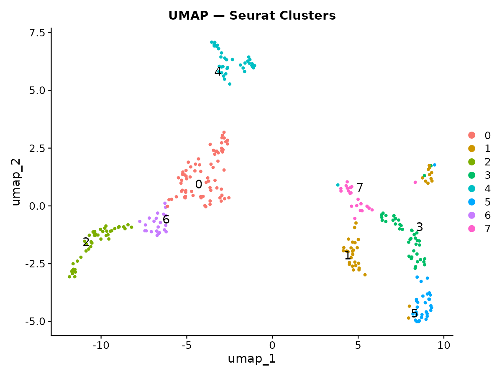
</p>

<h1 align="center">LongViewSC</h1>
<p align="center">
  <b>Interactive visualisation of gene and isoform expression in long-read single-cell data</b><br/>
  Developed by the <a href="https://biomedicalsciences.unimelb.edu.au/sbs-research-groups/anatomy-and-physiology-research/stem-cell-and-developmental-biology/clark-lab">Clark Laboratory</a>, University of Melbourne
</p>

<p align="center">
  <a href="https://longviewsc.researchsoftware.unimelb.edu.au/LongViewSC/"></a>
  &nbsp;
  <a href="https://sefi196.github.io/FLAMESv2_LR_sc_tutorial/"></a>
  &nbsp;
  <a href="https://github.com/Sefi196/LongViewSC"></a>
</p>

---

## Workflow

<table>
<tr>
<td align="center" width="25%"><b>1️⃣ Load your data</b><br/>Upload a Seurat object (<code>.rds</code>, <code>.qs</code>, <code>.qs2</code>) or try the built-in demo dataset.</td>
<td align="center" width="25%"><b>2️⃣ Configure</b><br/>Select gene, isoform assay, dimensional reduction, metadata column, and optionally a GTF file.</td>
<td align="center" width="25%"><b>3️⃣ Run Analysis</b><br/>Press <b>Run Analysis</b>. The top 4 isoforms are pre-selected — use coloured chips to toggle isoforms across tabs.</td>
<td align="center" width="25%"><b>4️⃣ Explore & export</b><br/>Navigate 8 interactive tabs. Download individual plots or generate a full HTML report.</td>
</tr>
</table>

---

## Visualisation Tabs

### 1 — Overview

> A high-level view of your dataset with a UMAP coloured by grouping variable, a gene-level feature plot, and a violin plot.

<p align="center">
  
  &nbsp;
  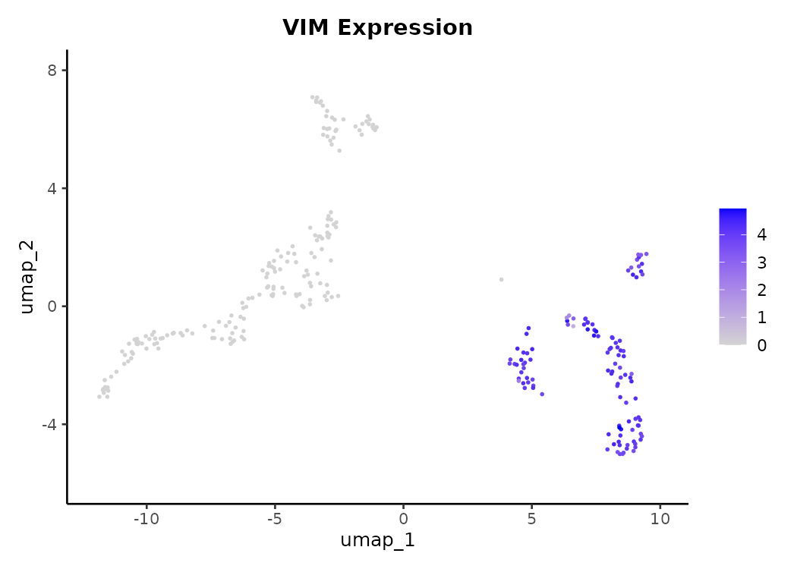
</p>
<p align="center">
  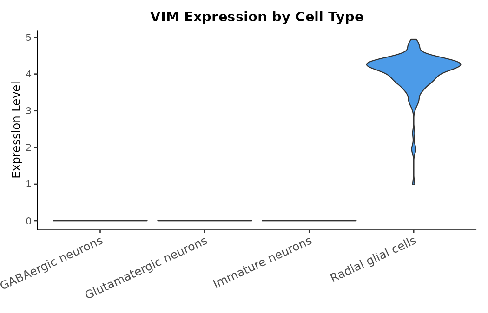
</p>
<p align="center"><i>UMAP coloured by cluster · VIM gene expression on UMAP · Violin plot by cluster</i></p>

---

### 2 — Isoform Statistics

> A searchable, sortable table of every isoform detected for the selected gene, with expression and detection statistics. Use this to identify the most relevant isoforms.

<p align="center">
  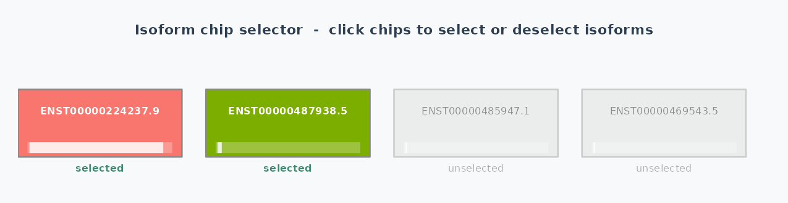
</p>
<p align="center">
  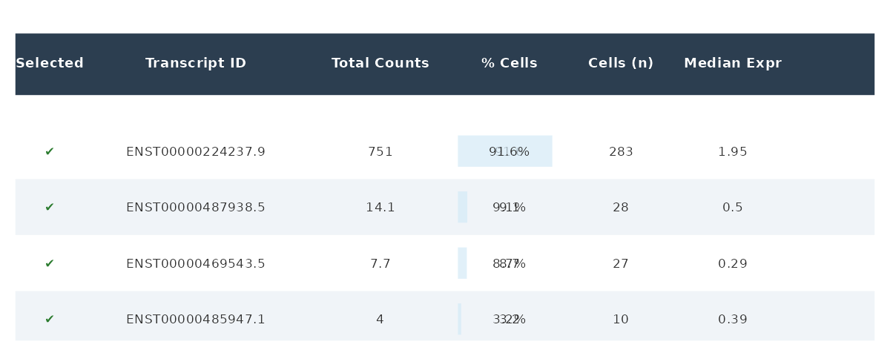
</p>
<p align="center"><i>Isoform chip selector (top) · Isoform statistics table — VIM isoforms with expression metrics (bottom)</i></p>

- Isoforms are named `ENST00000XXXXX.X-GENE` (e.g. `ENST00000224237.9-VIM`).
- A ✓ marks isoforms currently selected in the chip panel.
- **Chip selector:** Coloured chips in the sidebar toggle which isoforms appear across Expression, Heatmap, Proportions and Trajectory tabs.

---

### 3 — Isoform Expression

> Single-cell resolution feature plots and violin plots for each selected isoform, projected onto the isoform-level UMAP embedding.

<p align="center">
  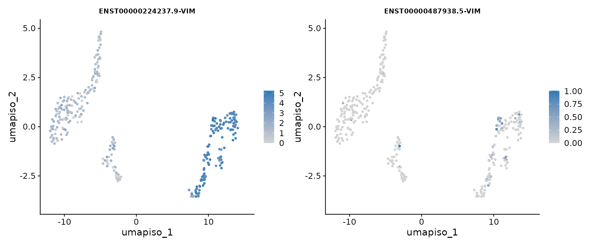
</p>
<p align="center"><i>VIM isoforms ENST00000224237 and ENST00000487938 on the isoform UMAP</i></p>

- **Feature plots** use the isoform-level UMAP (`umap_iso`) if present, otherwise the gene-level UMAP.
- **Violin plots** show expression per isoform, grouped by your chosen metadata column.

> **Important:** Set the **Isoform Assay** field in the sidebar to the correct assay name (e.g. `iso`) before clicking Run Analysis.

---

### 4 — Transcript Structure

> Visualises the exon-intron architecture of each selected isoform from your uploaded GTF file.

<p align="center">
  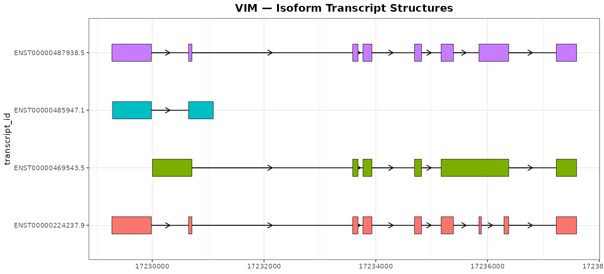
</p>
<p align="center"><i>Exon-intron structure of all four VIM isoforms</i></p>

- Exons are drawn as filled blocks; introns as directional arrows showing strand.
- Upload a `.gtf` file in the sidebar — if omitted this tab is empty.

> **Naming:** Isoforms must follow the format `ENST00000XXXXX.X-GENENAME` for automatic GTF matching.

---

### 5 — Pseudobulk Heatmap

> Aggregates isoform counts per group, normalises to log(CPM+1), and renders an interactive clustered heatmap.

<p align="center">
  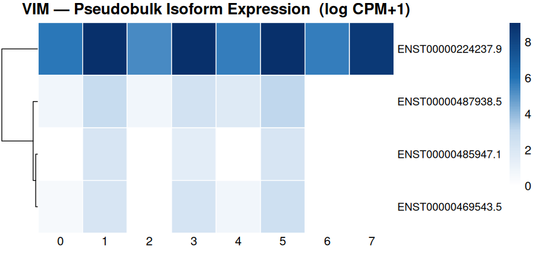
</p>
<p align="center"><i>VIM isoform pseudobulk expression (log CPM+1) across 8 clusters</i></p>

- Rows are isoforms; columns are groups; colour intensity = log(CPM+1).
- Fully interactive — hover for exact values, zoom, pan, and download.

---

### 6 — Isoform Proportions

> Faceted pie charts — one per group — showing each isoform's proportion of total gene expression. Ideal for detecting isoform switching.

<p align="center">
  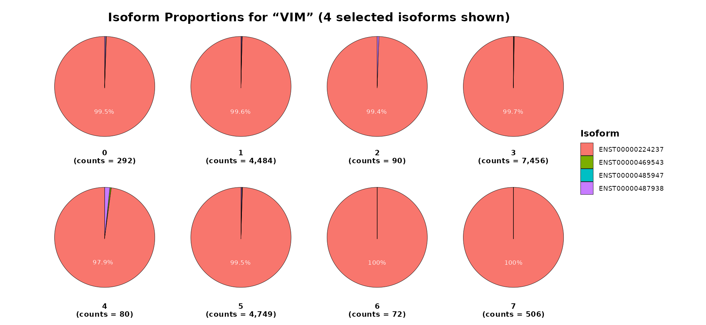
</p>
<p align="center"><i>VIM isoform proportions across all 8 clusters</i></p>

- Selected isoforms shown as distinct colours; all others grouped as **Other isoforms** (grey).
- Percentages displayed for slices > 5%.

> **Isoform switching:** A shift in the dominant colour across groups indicates a switch in the preferred isoform.

---

### 7 — Expression Trajectory

> Plots isoform expression across an ordered sequence of groups with a loess smooth per isoform panel.

<p align="center">
  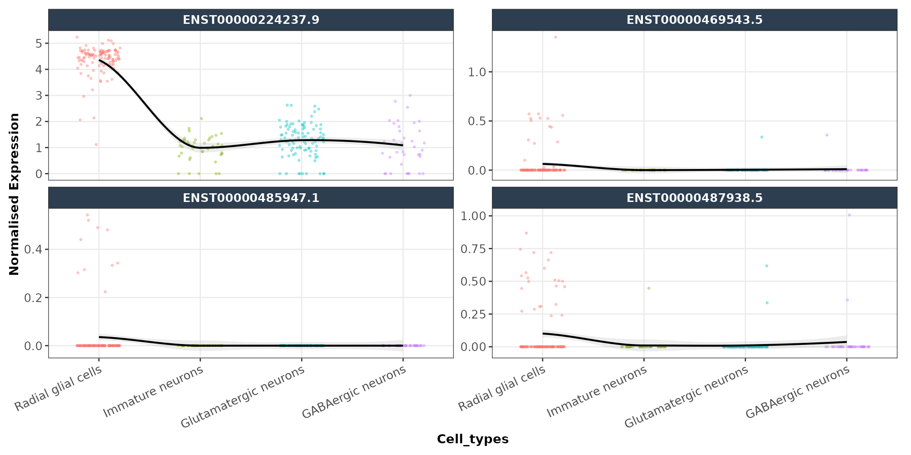
</p>
<p align="center"><i>VIM isoform expression trajectory — loess smooth with 95% confidence ribbon per isoform</i></p>

- **Drag and drop** group labels in the sidebar to define the left-to-right ordering.
- Each isoform gets its own panel with an independent y-axis.

---

### 8 — Compare Two Isoforms

> Directly compare any two isoforms or genes at single-cell resolution across three complementary views.

<p align="center">
  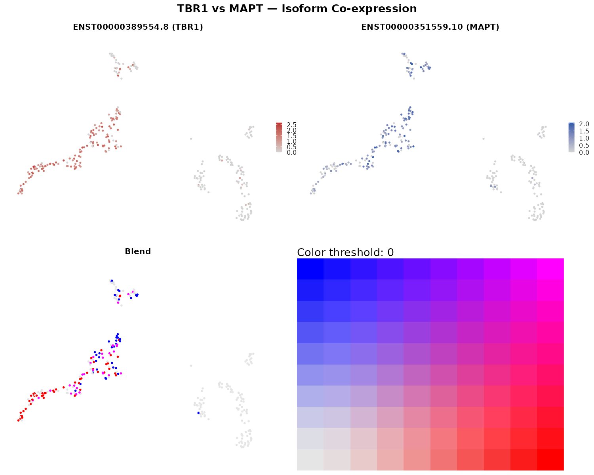
</p>
<p align="center"><i>Top: individual expression maps · Bottom: UMAP blend (red = TBR1, blue = MAPT, purple = co-expressed)</i></p>

- **Blend:** UMAP blend — one isoform red, the other blue, co-expressing cells purple.
- **Scatter:** X = isoform 1 expression, Y = isoform 2. Includes linear fit and R².
- **Feature Map:** Categorises each cell as Both, Only X, Only Y, or Neither.

---

## Input Data Format

| File | Details |
|------|---------|
| **Seurat Object** (`.rds` / `.qs` / `.qs2`) | Must contain a gene assay (e.g. `RNA`) and isoform assay (e.g. `iso`). Isoform IDs must follow `ENST00000XXXXX.X-GENENAME`. Requires at least one dimensional reduction and a metadata grouping column. |
| **GTF Annotation** (`.gtf`) — optional | Standard GTF with `transcript_id` attribute. Only needed for the Transcript Structure tab. Files up to 5 GB supported locally. |

See the [FLAMESv2 Tutorial](https://sefi196.github.io/FLAMESv2_LR_sc_tutorial/) for generating compatible Seurat objects.

**Performance tips:**
- Online: keep uploads under 200 MB.
- Local: use `qs::qsave()` — up to 10x faster than `.rds` for large objects.

---

## Installation

### Option 1 — Use Online
```
https://longviewsc.researchsoftware.unimelb.edu.au/LongViewSC/
```

### Option 2 — Local Installation

```bash
git clone https://github.com/Sefi196/LongViewSC.git
cd LongViewSC
conda env create -f environment.yml
conda activate LongViewSC_env
```

Install ggtranscript (not on conda):
```bash
Rscript -e "devtools::install_github('dzhang32/ggtranscript')"
```

Launch the app:
```bash
Rscript -e "shiny::runApp('app.R', launch.browser=TRUE)"
```

Runs entirely locally — no data is sent online.

---

<p align="center">
  Developed by <b>Sefi Prawer</b> — Clark Laboratory, University of Melbourne<br/>
  📧 <a href="mailto:sefi.prawer@unimelb.edu.au">sefi.prawer@unimelb.edu.au</a> &nbsp;|&nbsp;
  If you use LongViewSC please cite our work.
</p>
